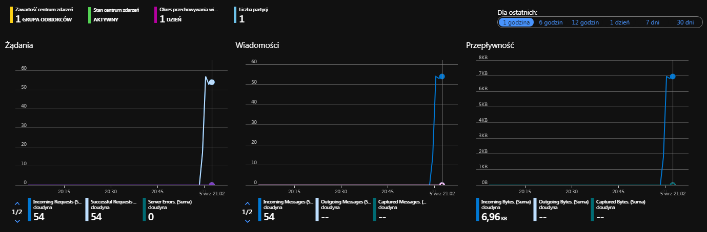

Na potrzeby tego kursu przygotowaliśmy prostą aplikację konsolową, imitującą działanie termometru. Aplikacja wysyła stan aktualnej temperatury (zmieniającej się w czasie), dokładnie co sekundę. Każda kolejna wartość generowana jest losowo. Wiadomość będzie wysyłana za pośrednictwem klienta Kafki, natomiast usługą, odpowiedzialną za odbieranie wiadomości po stronie chmury, będzie usługa Azure Event Hub.

## Azure Event Hub

Azure Event Hub pozwala na strumieniowe przesyłanie milionów wiadomości na sekundę. Usługa ta jest w pełni skalowalna. Zdarzenia wysyłane mogą być z dowolnego źródła danych. Azure Event Hub umożliwia tworzenie tzw. dynamicznych strumieni danych. Praca na tego typu strumieniach pozwala na niemalże natychmiastowe reagowanie na wszelkie aspekty biznesowe. Usługa umożliwia integrację z jednym z najpopularniejszych brokerów wiadomości, jakim bez wątpienia jest Apache Kafka. Tego typu połączenie pozwala w prosty sposób przesyłać wszelkiego rodzaju dane do chmury, dzięki czemu możliwa będzie ich analiza za pomocą usług PasS'owych już na platformie Microsoft Azure.

Warto również wspomnieć, że Azure Event Hub, nie opiera się tylko i wyłącznie na protokole Kafkowym. Do wyboru mamy również m.in. Advanced Message Queuing Protocol (AMQP) czy HTTPS. Do autentyfikacji wykorzystywane są tokeny Shared Access Signature (SAS tokens), które można definiować zarówno na poziomie przestrzeni nazw, jak i na poziomie samych event hubów.

Wszystkie zdarzenia, jakie zostaną przesłane do huba, przechowywane są w strumieniach za pośrednictwem partycji - jeden event hub może mieć od 2 do 32 partycji, aczkolwiek dostęp do jakiejkolwiek z nich może mieć tylko jeden konsument. Za przepustowość usługi Azure Event Hub odpowiadają jednostki przepływności, których liczbę określamy na poziomie tworzenia usługi.

## Apache Kafka

Najważniejszą cechą Kafki, stawiającą ją wysoko w rankingu technologii przesyłania wiadomości, jest jej wydajność i niezawodność. Strumień zrealizowany za pośrednictwem tej technologii jest w stanie osiągnąć przepustowość nawet do 100k wiadomości na sekundę. Wszystkie zdarzenia grupowane są w tzw. tematy (topics). Nadawca wysyła kolejne wiadomości, przypisane do jednego tematu, natomiast odbiorcy nasłuchują na jeden wybrany temat. Dzięki takiemu rozwiązaniu dochodzi do stworzenia powiązania pomiędzy nadawcą, a odbiorcą.

Więcej informacji na temat powyższych komponentów można znaleźć odwiedzając następujące linki:

* [Azure Event Hub](https://docs.microsoft.com/en-us/azure/event-hubs/)
* [Apache Kafka](https://kafka.apache.org/documentation/)

### Zadania

Mamy dla Ciebie trzy zadania do wykonania.

#### Subskrypcja Azure

Jeżeli jeszcze nie masz konta na Azure stwórz takowe, [tutaj](https://azure.microsoft.com/pl-pl/free/) znajdziesz dokładny opis jak je założyć.

#### Device Simulator

Rozpakuj projekt aplikacji Device Simulator, napisany w języku C# za pośrednictwem środowiska Visual Studio. Następnie pobierz wszystkie niezbędne zależności oraz spróbuj zbudować symulator.

#### Integracja z Azure Event Hub oraz konfiguracja symulatora

- Stwórz nową grupę zasobów, wewnątrz której będziesz przechowywał wszystkie niezbędne usługi, wykorzystywane w ramach tego kursu.
- Następnie dodaj nową instancję usługi Azure Event Hub. Podpowiedź: platforma Kafka dostępna jest tylko w ramach **Standardowej warstwy cenowej**. 
- Kiedy usługa będzie już gotowa przejdź do zakładki Jednostki -> Event Hubs, a następnie dodaj nowy hub. 
- Na koniec czeka Cię poprawne uzupełnienie pliku **App.config**, znajdującego się wewnątrz projektu DeviceSimulator. Pamiętaj o uwzględnieniu następujących właściwości:

    - EVENT_HUB_NAMESPACE
    - EVENT_HUB_CONNECTION_STRING
    - EVENT_HUB_NAME

- Następnie uruchom aplikację. Po kilku minutach możesz podejrzeć ruch widoczny w usłudze Event Hub na portalu. Powinien być on zbliżony do poniższego:

