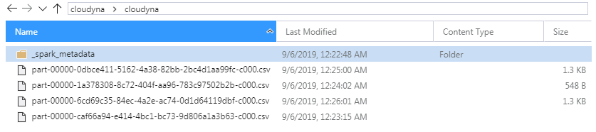
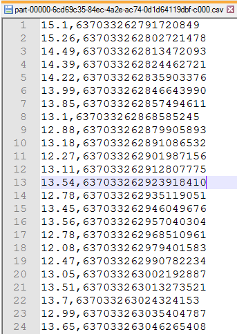

W ramach dzisiejszego odcinka zajmiemy się przygotowaniem właściwego magazynu na dane, jakim będzie Azure Data Lake Storage, oraz zabezpieczeniem go przy pomocy Azure Active Directory. Następnie z wykorzystaniem odpowiedniego strumienia komponentu Spark Streaming zapiszemy dane pomiarowe w osobnych plikach *.csv dla każdego 1 minutowego okna.

### Azure Data Lake Storage

Usługa Azure Data Lake Storage to nic innego jak wysoce wydajny oraz zoptymalizowany pod kątem dużego wolumenu magazyn na dane. Charakteryzuje się hierarchiczną strukturą plików, jest w pełni skalowany, doskonale integruje się z HDFS'em oraz platformą Apache Spark. Azure Data Lake Storage stanowi teoretycznie nieograniczony magazyn na dane. Odznacza się również automatyczną replikacją danych.

### Active Directory

Azure Active Directory jest usługą pozwalającą na bezproblemowy i wysoce bezpieczny dostęp do poszczególnych zasobów oraz usług wewnątrz subskrypcji Azure'owej. Usługa umożliwia ochronę tożsamości samych użytkowników, ale i klientów czy partnerów. Zapewnia prostą i wygodną w obsłudze kontrolę nad rolami oraz użytkownikami. Pozwala również na nadawanie wszelkiego rodzaju ograniczeń dostępu dla wybranych usług i użytkowników.

### Zadania

Mamy dla Ciebie dwa zadania do wykonania. Pamiętaj, żeby po wykonaniu wszystkich zadań **wyłączyć** klaster w celu zaoszczędzenia pieniędzy na subskrypcji.

### Stworzenie usługi Azure Active Directory

- Do stworzonej wcześniej grupy zasobów dodaj usługę Azure Active Directory.
- Następnie przejdź do zakładki **Rejestracje aplikacji** i dodaj nową rejestrację.
- Kliknij po lewej stronie w zakładkę **Certyfikaty i klucze tajne**
- Dodaj nowy klucz dla klienta - zapamiętaj/zapisz go.

### Stworzenie usługi Azure Data Lake Storage (Gen. 2)

- Do stworzonej wcześniej grupy zasobów dodaj usługę konto magazynu (Storage Account).
- W sekcji rodzaj konta wybierz **StorageV2**.
- W zakładce **Zaawansowane** znajdziesz opcję **Data Lake Storage Gen2 - Hierarchiczna przestrzeń nazw** którą **KONIECZNIE** włącz.
- Po stworzeniu zasobu zajmiemy się konfiguracją uprawnień. W tym celu kliknij w usługę, następnie wybierz **Systemy plików usługi Data Lake Gen2** oraz zakładkę **Kontrola dostępu**.
- Teraz przejdź na zakładkę **Przypisania ról** oraz dodaj nowe przypisanie roli. Przypisz rolę **Storage Blob Data Contributor** do stworzonego w ramach usługi Azure Active Directory podmiotu. 
- Na sam koniec stwórz nowy system plików wewnątrz usługi Azure Data Lake Storage oraz, za pośrednictwem aplikacji [Azure Storage Explorer](https://azure.microsoft.com/en-us/features/storage-explorer/), stwórz dwa przykładowe foldery wewnątrz magazynu danych.

### Integracja Azure Databricks z Azure Data Lake Storage

- Przechodzimy do konfiguracji Azure Data Lake Storage w ramach usługi Azure Databricks i platformy Apache Spark. Przygotowanie pliku konfiguracyjnego:

```python
adls_config = {
  "fs.azure.account.auth.type": "OAuth",
  "fs.azure.account.oauth.provider.type": "org.apache.hadoop.fs.azurebfs.oauth2.ClientCredsTokenProvider",
  "fs.azure.account.oauth2.client.id": "[AZURE_AD_CLIENT_ID]",
  "fs.azure.account.oauth2.client.secret": "[AZURE_AD_SECRET_KEY]",
  "fs.azure.account.oauth2.client.endpoint": "https://login.microsoftonline.com/[AZURE_AD_TENANT_ID]/oauth2/token"
}
```

- Teraz zajmiemy się podmontowaniem stworzonego wcześniej systemu plików:

```python
dbutils.fs.mount(
  source = "abfss://[FILE_SYSTEM_NAME]@[STORAGE_ACCOUNT_NAME].dfs.core.windows.net/",
  mount_point = "/mnt/data/",
  extra_configs = adls_config
)
```

- Za pomocą następującego polecenia możemy sprawdzić czy stworzone przez nas foldery są widoczne:

```python
dbutils.fs.ls("/mnt/data/")
```

- Na sam koniec zajmiemy się przygotowaniem odpowiedniego strumienia zapisującego pliki *.csv z danymi na Azure Data Lake Storage. Pamiętaj o uruchomieniu **DeviceSimulatora**. Przykładowy kod:

```python
from pyspark.sql.functions import get_json_object

save_to_csv = df \
  .select( \
          get_json_object(df.value.cast("string"), "$.Temperature").alias("Temperature"), \
          get_json_object(df.value.cast("string"), "$.Timestamp").alias("Timestamp")) \
  .writeStream \
  .format("csv") \
  .queryName("save_csvs_to_adls") \
  .option("path", "/mnt/data/[DIRECTORY_NAME]") \
  .option("checkpointLocation", "/mnt/sample/checkpoints") \
  .trigger(processingTime="60 seconds") \
  .start()
```

- Po kilku minutach, za pośrednictwem aplikacji Azure Storage Explorer, powinieneś być w stanie podejrzeć (oraz pobrać) pliki z danymi:



Przykładowy plik *.csv:


