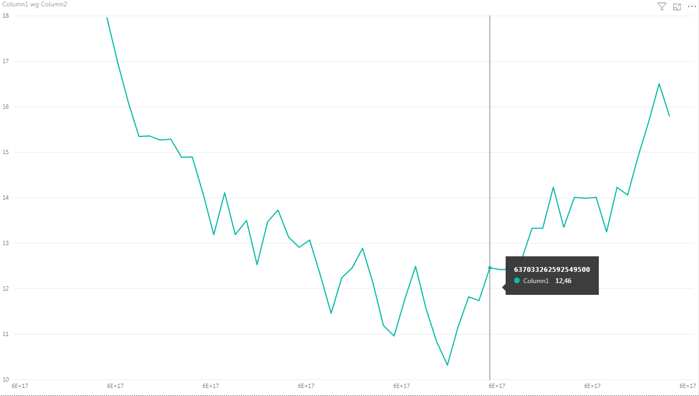

W ramach dzisiejszego odcinka zajmiemy się przygotowaniem prostej wizualizacji za pośrednictwem narzędzia PowerBI. Dane pobierane będą bezpośrednio z wykorzystanego wcześniej magazynu danych Azure Data Lake Storage Gen2.

### Power BI

Power BI jest usługą pozwalającą na bardzo łatwe i szybkie tworzenie rozbudowanych, a przede wszystkim interaktywnych raportów. Power BI posiada ogromną liczbę wbudowanych connectorów, dzięki którym można szybko podłączyć z usługami:

- chmurowymi np.: Azure SQL Database, CosmosDB, czy Azure Data Lake Storage,
- bazodanowymi np.: MySql, SQL Server, Amazon Redshift,
- online, np: Facebook, Google Analytics, Microsoft Exchange Online,
- innymi, popularnymi usługami, np: Apache Spark, Active Directory czy skryptami języka Python.

Power BI pozwala na szczegółową analizę danych, która doprowadzić może do znalezienia pewnych wzorców i zależności pomiędzy danymi. Odnalezione reguły mogą mieć istotne znaczenie podczas podejmowania niejednej decyzji biznesowej.

### Zadanie

Mamy dla Ciebie dwa zadania do wykonania.

#### Pobierz i zainstaluj Power BI Desktop

W ramach tego zadania pobierz i zainstaluj aplikację do generowania interaktywnych raportów jaką jest Power BI. Link do aplikacji znajdziesz [tutaj](https://powerbi.microsoft.com/pl-pl/desktop/).

#### Stwórz prosty wykres liniowy prezentujący zmiany temperatury w czasie

- Na początku zacznij od skonfigurowania źródła danych. W kategorii Azure znajdziesz opcję pozwalającą na skorzystanie z usługi Azure Data Lake Storage Gen2. 
- Połącz się z nią podając odpowiedni adres URL oraz klucz dostępu, a następnie załaduj wszystkie dane - a w szczególności pliki *.csv, które zostały tam zapisane w ramach poprzednich zadań. 
- Teraz zajmiemy się przygotowaniem właściwego zapytania. Naciśnij przycisk **Edycja zapytania**, wybierz jeden z plików *.csv z danymi pomiarowymi, a następnie kliknij w napis **Binary**, znajdujący się po lewej stronie. Power BI powinien załadować dane oraz przedstawić Ci ich podgląd. 
- Zajmiemy się teraz zmianą typu danych w pierwszej kolumnie. Kliknij prawym przyciskiem myszy na nazwę kolumny, a następnie wybierz opcję **Zmień wartości...**. Zamień wszystkie kropki (.) na przecinki (,). Teraz ponownie kliknij prawym przyciskiem myszy i zmień typ na **liczbę dziesiętną**. Na końcu wciśnij ikonkę **Zamknij i zastosuj**.
- Po prawej stronie edytora powinna być widoczna nowa zakładka z dostępnymi w ramach zapytania polami. Stwórz teraz nowy wykres liniowy przypisując kolumny na odpowiednie osie. Efekt powinien być zbliżony do następującego:

